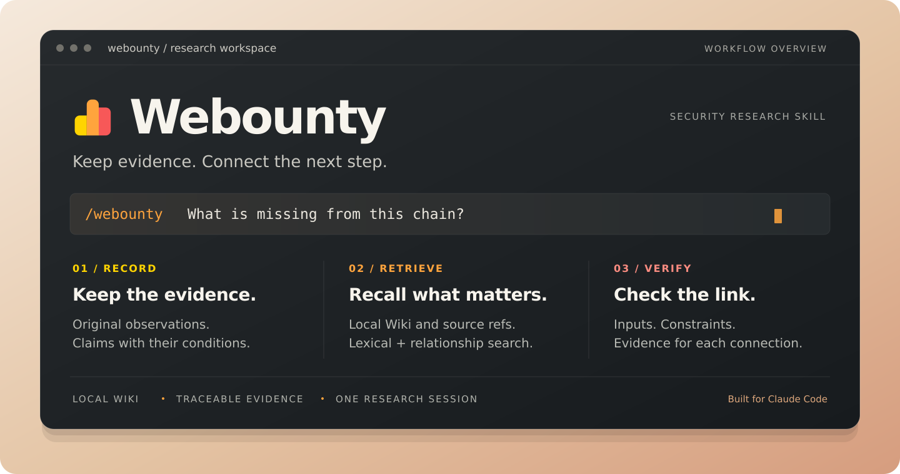

<p align="center">
  <strong>Webounty</strong> 是面向 Claude Code 的漏洞研究 Skill。<br />
  用本地 Wiki 串起证据、前提与候选链，让长会话里的研究持续推进。
</p>

<p align="center">
  
</p>

<p align="center">
  <a href="#quickstart">快速开始</a> ·
  <a href="#how-it-works">工作方式</a> ·
  <a href="#docs">文档</a> ·
  <a href="./LICENSE">MIT License</a>
</p>

---

## Quickstart

需要 **Python 3.10+**。核心脚本只使用标准库；CVSS 3.1 计算器另需 **Node.js 18+**。

### 安装

克隆到 Claude Code 的个人技能目录：

```shell
git clone https://github.com/do-whilefor/Webounty.git ~/.claude/skills/webounty
```

<details>
<summary>仅在当前项目使用，或手动安装</summary>

在项目根目录执行，安装到该项目的技能目录：

```shell
git clone https://github.com/do-whilefor/Webounty.git .claude/skills/webounty
```

也可以下载仓库 ZIP，解压后将目录重命名为 `webounty`，放入个人或项目的 `skills/` 目录。确保 `SKILL.md` 直接位于 `webounty/` 下，不要多套一层目录。

更新时替换完整技能目录，保留项目内正在使用的 `.webounty/` 会话资料。系统仅提供 `python` 命令时，先确认版本，再替换文档中的 `python3`。

</details>

### 开始研究

在 Claude Code 中输入 `/webounty`，说明目标、范围与完成条件。例如：

```text
/webounty 分析当前授权项目的访问控制，保存原始证据和未决前提，检查可组合的能力。
```

后续问题继续使用同一研究会话。Webounty 将资料保存在项目的 `.webounty/<会话标识>/` 中，按需检索前面的发现、失败原因与待验证连接。

上下文压缩后，可通过 `--refresh` 恢复当前查询的完整视图；支持上下文代次的宿主也可传入 `--context-epoch`。具体用法见[会话与恢复说明](./references/claude-code.md#会话语义)。

使用 Codex 或其他宿主时，可按[宿主接入说明](./references/claude-code.md)调用脚本工作流，并显式提供技能路径和会话 ID。

## How it works

**把已有证据用起来，再决定下一步验证什么。**

| 保存证据 | 召回上下文 | 检查连接 |
| --- | --- | --- |
| 原始响应、日志和源码单独保存；Wiki 记录结论、条件与缺口。 | 通过词法、别名和显式关系查找资料；按 ID 或字段精读原件。 | 匹配能力的提供者与消费者，检查共同条件、反证和未满足的输入。 |

宿主负责推理与取证，脚本负责存储、检索和条件检查。检索采用**词法检索 + 显式关系图扩展**，无需 Embedding API、向量数据库或额外模型服务。

候选连接仍需实际验证。来源修订或新反证出现时，相关记录会提示复核；压缩视图保留目标与约束，原件按需展开。详见[检索与链路组合](./references/retrieval.md)。

## Docs

| 想了解什么 | 从这里开始 |
| --- | --- |
| 技能工作循环与命令入口 | [SKILL.md](./SKILL.md) · [宿主接入](./references/claude-code.md) |
| 如何保存观察、判断和 Wiki | [存储格式](./references/storage.md) · [Wiki 组织](./references/wiki-layout.md) · [记录示例](./assets/record-example.json) |
| 如何召回资料、补齐链路缺口 | [检索与组合](./references/retrieval.md) · [问题级检索](./references/question-retrieval.md) |
| 如何对照观察、验证与评分 | [观察对照](./references/observation-comparison.md) · [方法库](./references/methods/) · [CVSS 评分](./references/scoring.md) |

<details>
<summary>开发与本地检查</summary>

在仓库根目录查看命令并运行测试：

```shell
python3 scripts/session.py --help
python3 -m unittest discover -s tests -p 'test_*.py'
```

测试使用虚构资料和临时目录。检索评估、会话回放与性能检查见[本地检查文档](./references/claude-code.md#本地检查)。

</details>

---

仅用于合法授权的安全研究、代码审计、CTF 与测试环境。脚本仅处理本地资料；实际取证沿用宿主工具与当前任务授权。

<details>
<summary>使用边界与免责声明</summary>

适用范围包括明确授权的漏洞赏金与 SRC 范围、用户自有系统与测试环境、CTF 与靶场、经授权的代码审计与漏洞复现。

禁止事项：

- 未经授权扫描、探测、入侵或利用第三方系统。
- DoS、DDoS、持续压测、资源耗尽或影响业务可用性的行为。
- 删除、破坏或不可逆修改真实业务数据。
- 建立 WebShell、后门、计划任务、启动项、反向 Shell 或其他持久化访问。
- 横向移动、攻击无关资产、窃取凭证、钓鱼、撞库或社会工程。
- 对非测试账号执行真实支付、退款、权限变更、批量通知或其他高影响业务操作。
- 违反适用法律、平台规则、漏洞赏金政策、SRC 规则或目标方明确限制的行为。

Skill、脚本、方法和文档仅用于合法授权的安全研究、教育、代码审计和测试环境。使用者必须自行确认拥有充分授权，并对目标范围、测试方法、工具配置、数据处理、证据保存、漏洞提交和后续影响承担全部责任。仓库作者不对任何未经授权的使用、错误配置、数据丢失、业务中断、法律责任、第三方索赔或其他直接或间接损失承担责任。

本仓库不保证能够发现漏洞，也不保证检索结果、候选链、工具输出、评分或漏洞结论始终正确、完整或适用于特定环境。检索分数、`ready`、`compatible` 与 `coverage.complete` 均不构成漏洞成立证明，任何结论都应独立验证。

本 Skill 不安装 hook、不修改客户端配置，脚本也不扫描网络或执行攻击。异常关窗或进程被终止时，不保证立即清理 `.webounty/` 下的会话资料。

</details>

本仓库中作者有权许可的原创和修改内容采用 [MIT License](./LICENSE)。
